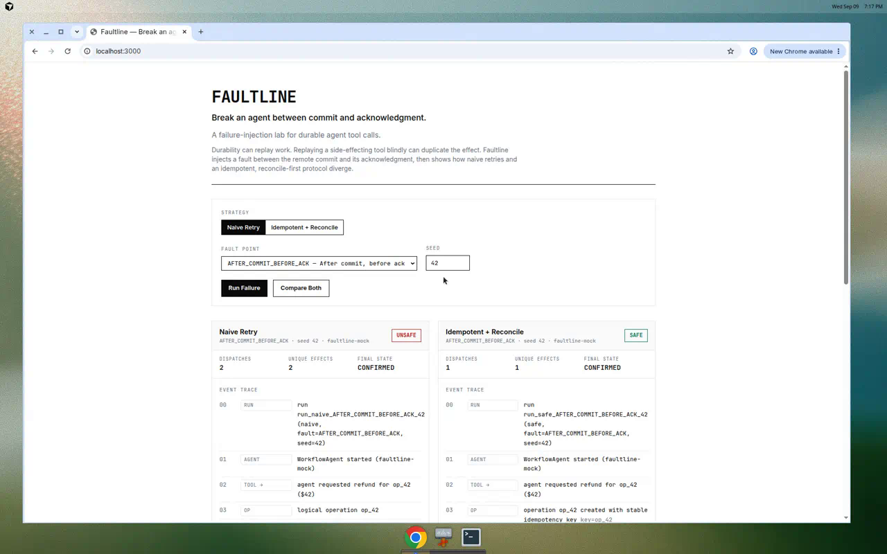
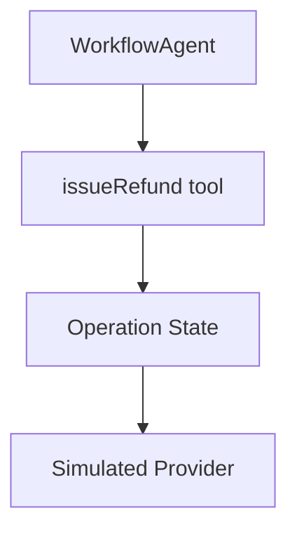

# Faultline

## Failure-injection lab for durable AI agent tool calls using Vercel AI SDK 7 WorkflowAgent.

**Break an agent between commit and acknowledgment.** A failure-injection lab
for durable agent tool calls.

Durable execution can replay work. Replaying a side-effecting tool call blindly
can duplicate the effect. Faultline makes that failure mode concrete: it injects
a fault at a precise point in a refund tool call and shows how a **naive retry**
and an **idempotent + reconcile** protocol diverge — with an evaluated set of
invariants for each run.



## The failure

- Durable execution (e.g. AI SDK's `WorkflowAgent`) can retry a tool step after an interruption.
- External writes are **not** automatically transactional with workflow state.
- A tool can commit remotely (money moves) while its local invocation appears to fail.
- If the acknowledgment is lost after the commit, the workflow is in an **ambiguous** state.
- Blind replay dispatches again and commits a **second** effect — a duplicate refund.
- The fix is stable operation identity, an idempotency key, and reconciling before any replay.

## Demo

The critical scenario is `AFTER_COMMIT_BEFORE_ACK`: the provider commits the
effect, then the acknowledgment is dropped.

**Naive trace** — blind replay duplicates the effect:

```
tool.requested        agent requests refund
provider.dispatch     dispatch #1
provider.commit       COMMIT effect_A
fault.injected        ACK lost
retry.started         workflow retries
provider.redispatch   dispatch #2
provider.commit       COMMIT effect_B      ← duplicate
tool.completed        succeeds
=> dispatchAttempts=2  uniqueEffects=2  NO_DUPLICATE_EFFECTS=FAIL
```

**Safe trace** — reconcile discovers the existing effect, no resend:

```
operation.created         op created with stable idempotency key
provider.dispatch         dispatch #1 using idempotencyKey=op_42
provider.commit           COMMIT effect_A
fault.injected            ACK lost
reconciliation.started    ambiguous → reconcile using op_42
reconciliation.found      existing effect_A discovered; no resend
tool.completed            succeeds
=> dispatchAttempts=1  uniqueEffects=1  NO_DUPLICATE_EFFECTS=PASS
```

Use **Compare Both** (the default landing view) to run naive and safe with an
identical fault and seed, side by side.

## Design

- **Operation identity** — every retry of a logical operation reuses the same stable `operationId`.
- **Idempotency** — the safe path sends the `operationId` as an idempotency key, so a repeated commit resolves to the same canonical effect.
- **Ambiguous state** — a fault after a *possible* commit is not a failure; it is unknown. The operation enters `AMBIGUOUS` rather than retrying.
- **Reconciliation** — from `AMBIGUOUS`, the executor queries the provider by idempotency key and only redispatches if reconciliation proves no effect exists.

The safe operation state machine: `CREATED → DISPATCHING → CONFIRMED`, with
`DISPATCHING → AMBIGUOUS → (reconcile) → CONFIRMED | DISPATCHING`, and `FAILED`
as the bounded-retry terminal.

### Invariants

Every run is scored against five invariants (`lib/invariants.ts`):

| Invariant | Meaning |
| --- | --- |
| `NO_DUPLICATE_EFFECTS` | The logical operation produced at most one side effect. |
| `STABLE_OPERATION_ID` | Every operation-scoped event used the same operation id. |
| `BOUNDED_RETRIES` | Dispatch attempts stayed within the retry bound. |
| `SINGLE_TERMINAL_STATE` | The run reached exactly one terminal state. |
| `RECONCILE_BEFORE_REPLAY` | No possibly-committed operation was replayed without reconciling first. |

The naive `AFTER_COMMIT_BEFORE_ACK` scenario is **expected** to fail
`NO_DUPLICATE_EFFECTS` and `RECONCILE_BEFORE_REPLAY`. That failure is the point
of the lab.

## Architecture



- `WorkflowAgent` (`@ai-sdk/workflow`) drives the agent loop with one tool, `issueRefund`.
- By default the model is a deterministic mock (`ai/test`), so no API key is needed and the exact tool call is reproducible.
- The tool delegates to a strategy executor (`lib/naive-executor.ts` / `lib/safe-executor.ts`) that owns the durable failure semantics.
- The executor drives the `SimulatedProvider` (`dispatch` / `commit` / `ack` / `reconcile`); all identifiers come from a seeded RNG (`lib/seeded-rng.ts`).

## Run locally

```bash
pnpm install
pnpm dev          # http://localhost:3000
```

Or run against the API directly:

```bash
curl -s -X POST localhost:3000/api/run \
  -H 'content-type: application/json' \
  -d '{"strategy":"naive","faultPoint":"AFTER_COMMIT_BEFORE_ACK","seed":42}'
```

## Tests

```bash
pnpm test         # vitest: provider, executors, invariants, WorkflowAgent, full matrix
pnpm typecheck    # tsc --noEmit
pnpm lint         # eslint
pnpm build        # next build
```

The suite tests every fault point × both strategies, the critical duplicate /
reconcile assertions, malformed API requests, the retry bound, stable operation
id, reconciliation, provider unavailability, and normalized-trace determinism.

## Environment variables

Faultline runs fully in its default deterministic mode with **no** environment
variables.

| Variable | Required | Purpose |
| --- | --- | --- |
| `AI_GATEWAY_API_KEY` | No | Enables optional "gateway" model mode via the Vercel AI Gateway. The core demo never depends on it. |
| `FAULTLINE_GATEWAY_MODEL` | No | Overrides the gateway model id (default `openai/gpt-4o-mini`). |

## What this does NOT prove

- The payment provider is **simulated and deterministic**. No real money or network calls occur.
- Faultline is a **failure-semantics lab, not a payment system**.
- The tests demonstrate the correctness of the **implemented recovery protocol**, not a property of any specific external provider.
- Faultline does **not** claim any AI SDK or Workflow SDK vulnerability or bug. No such claim should be made unless it is independently reproduced and demonstrated.

## Related work

- [AI SDK — Agents / WorkflowAgent](https://ai-sdk.dev/docs)
- [Workflow DevKit](https://github.com/vercel/workflow)
- [Vercel AI SDK](https://github.com/vercel/ai)

The naive-vs-idempotent duplication described here is the well-known
"at-least-once delivery + non-idempotent side effect" problem; the safe path is
the standard idempotency-key + reconciliation remedy. If any behavior here
overlaps an existing upstream issue, link that issue rather than claiming a
discovery.

## Stack

Next.js (App Router) · React · TypeScript (strict) · Tailwind CSS ·
`ai` · `@ai-sdk/workflow` · `workflow` · `zod` · Vitest.
